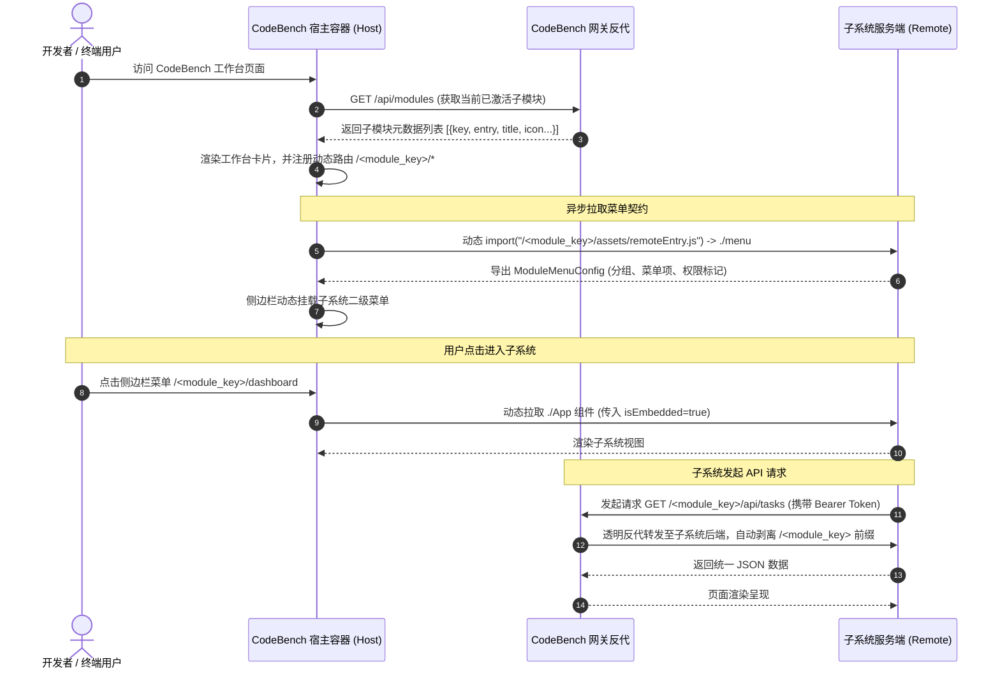

# CodeBench 子系统微前端插件化开发接入指南 🚀

> **面向读者**：需要接入 CodeBench 统一门户的新业务子系统开发团队及研发人员。  
> **核心目标**：指导开发者基于公共资产库 `code-common` 快速开发独立的业务子系统，并在 CodeBench 宿主容器中实现**零代码修改（仅改配置）的即插即用动态接入**。

---

## 1. 概述与核心价值

CodeBench 是面向研发效能与资产看护的一站式综合工作台宿主（Host）应用。为了解决以往“每接入一个新子系统都需要修改宿主代码、修改路由并重新编译发版”的痛点，CodeBench 现已支持**插件化运行时动态加载与零代码接入能力**。

### 🌟 核心特性
*   **零代码侵入接入**：CodeBench 宿主完全无需硬编码子模块的 Remote 地址或路由规则。新增或卸载子系统仅需在 `config.yaml` 的 `gateways` 中添加/删除配置，即刻生效。
*   **运行时动态联邦**：基于 **Vite Module Federation (模块联邦)** 协议与原生 ES Module 动态 `import()`，在浏览器运行时按需动态拉取子应用入口（`remoteEntry.js`）及组件。
*   **双向契约自愈**：各子系统自主决定并导出自身的侧边栏二级菜单结构（`./menu`）与根视图组件（`./App`），支持静态菜单、异步远程拉取及动态更新订阅。
*   **深度基础设施下沉**：深度整合公共库 `code-common`，统一鉴权中间件、统一响应包装、统一单模型（User / Dept）、统一分页组件、统一反向代理网关及暗黑/明亮双模设计令牌（Design Tokens）。

---

## 2. 整体架构与运行原理解析

### 2.1 架构交互拓扑



### 2.2 核心机制说明
1.  **网关路由自动代理**：CodeBench 启动时解析 `config.yaml` 中的 `gateways` 列表，自动为每个配置的模块注册 Gin 反向代理规则：
    *   `/<module_key>/api/*`：透明转发至子微服务后端，跳过宿主审计，由子微服务自身审计中间件记录。
    *   `/<module_key>/assets/*` 与 `/<module_key>/remoteEntry.js`：透明转发至子系统的前端静态资源服务。
2.  **API 前缀自动剥离**：通过使用 `code-common/backend/server` 启动子系统服务并指定 `Prefix: "<module_key>"`，底层会自动剥离 `/<module_key>` 前缀。子系统后端在 Gin 注册路由时只需声明原生的 `/api/*`，完全无需关心外部代理前缀。
3.  **动态容器容错与沙箱**：宿主前端使用 `DynamicRemoteApp` 包装远程组件，内建 `ErrorBoundary` 与全局 `Suspense` 骨架屏。若子系统未启动或静态资源加载失败，页面呈现友好的“重试/不可用”提示卡片，绝不会导致宿主或其他子系统崩溃白屏。

---

## 3. 接入前准备与技术栈规范

为了确保子系统能够与平台其他服务无缝协同，团队约定以下技术选型规范：

| 领域 | 推荐技术栈 | 强制/遵循要求 |
| :--- | :--- | :--- |
| **前端框架** | React 18 + Vite 5 + TypeScript | 遵循 ESM 规范，严禁滥用 `any` 类型 |
| **微前端方案**| `@originjs/vite-plugin-federation` | 暴露 `./App` 与 `./menu` 模块 |
| **前端公共库**| `@code/common` | 必须使用统一主题 Token、`Pagination`、`createApiClient` 等 |
| **后端框架** | Go (1.21+) + Gin + GORM v2 | 严格显式处理 `error`，禁止忽略错误 |
| **后端公共库**| `code-common/backend` | 统一使用 `server.Run`、`auth.AuthMiddleware` 与 `utils` 响应包装 |
| **数据库**   | PostgreSQL 14+ | 共享数据库连接，核心实体引用 `code-common/backend/models` |

---

## 4. 子系统开发全流程实战

假设我们要开发一个名为 **产品数据管理（`pdm`）** 或 **监控诊断（`monitor`）** 的全新子系统，下面以模块名 `monitor` 为例，分步展示开发过程。

### Step 1: 工程目录结构规范

推荐子系统遵循如下标准工程组织结构：

```text
code-monitor/
├── Makefile                      # 统一构建与测试脚本
├── config.yaml                   # 子系统本地配置文件
├── main.go                       # 后端启动入口
├── go.mod                        # Go 模块描述 (依赖 code-common/backend)
├── database/                     # 数据库连接与初始化
├── models/                       # 业务 GORM 模型定义
├── handlers/                     # API 控制器处理函数
└── frontend/                     # 前端工程
    ├── package.json              # 依赖 @code/common 与 vite-plugin-federation
    ├── vite.config.ts            # 模块联邦与 base 配置 (关键!)
    └── src/
        ├── App.tsx               # 根组件 (必须支持 isEmbedded 参数)
        ├── menu.ts               # 菜单契约文件 (必须暴露 ModuleMenuConfig)
        ├── pages/                # 业务页面组件
        └── api/                  # 统一 API 客户端调用层
```

---

### Step 2: 前端模块联邦配置 (`frontend/vite.config.ts`)

子系统的前端必须通过 `@originjs/vite-plugin-federation` 插件暴露自身的 `./App` 与 `./menu`，且 `base` 路径必须设置为 `/<module_key>/`。

```typescript
import { defineConfig } from 'vite';
import react from '@vitejs/plugin-react';
import federation from '@originjs/vite-plugin-federation';

export default defineConfig({
  plugins: [
    react(),
    federation({
      name: 'monitor',                                // 子应用名称（必须与 gateway key 一致）
      filename: 'remoteEntry.js',                      // 模块联邦入口文件名，固定为 remoteEntry.js
      exposes: {
        './App': './src/App.tsx',                     // 暴露业务根组件
        './menu': './src/menu.ts',                    // 暴露侧边栏菜单配置
      },
      shared: ['react', 'react-dom', 'react-router-dom'], // 共享核心依赖实例，避免多份 React 冲突
    }),
  ],
  // 关键：base 必须设置为 /<module_key>/，末尾必须带正斜杠
  base: process.env.VITE_BASE_PATH || '/monitor/',
  build: {
    target: 'esnext',
    minify: false,
    cssCodeSplit: false,                              // 保持样式打包入单文件，防止微应用样式丢失
  },
  server: {
    port: 5180,                                       // 本地独立开发调试端口
    proxy: {
      '/monitor/api': {
        target: 'http://192.168.56.18:8090',
        changeOrigin: true,
      },
      '/api': {
        target: 'http://192.168.56.18:8090',
        changeOrigin: true,
      },
    },
  },
});
```

> [!IMPORTANT]
> 1. `base` 路径必须为 `/<module_key>/`。CodeBench 宿主会在 `/<module_key>/assets/remoteEntry.js` 请求入口文件。
> 2. `shared` 必须包含 `['react', 'react-dom', 'react-router-dom']`，确保子系统与宿主共享统一的 React 上下文与路由调度。

---

### Step 3: 实现侧边栏菜单契约 (`frontend/src/menu.ts`)

CodeBench 会在左侧侧边栏动态读取各子系统的菜单配置。子系统必须提供 `src/menu.ts`，导出符合 `@code/common` 标准的 `ModuleMenuConfig`。

```typescript
import type { SubMenuItem, MenuGroup, ModuleMenuConfig } from '@code/common';
export type { SubMenuItem, MenuGroup, ModuleMenuConfig };

// 1. 静态或默认菜单配置
export const monitorMenuConfig: ModuleMenuConfig = {
  moduleKey: 'monitor',
  moduleName: '监控诊断 (Code Monitor)',
  groups: [
    {
      title: '监控中心',
      items: [
        {
          path: '/dashboard',                         // 相对子路径，宿主会自动拼接为 /monitor/dashboard
          label: '集群监控概览',
          icon: 'M3 12l2-2m0 0l7-7 7 7M5 10v10a1 1 0 001 1h3m10-11l2 2m-2-2v10a1 1 0 01-1 1h-3m-6 0a1 1 0 001-1v-4a1 1 0 011-1h2a1 1 0 011 1v4a1 1 0 001 1m-6 0h6', // SVG Path 字符串
        },
        {
          path: '/metrics',
          label: '实时指标大盘',
          icon: 'M16 8v8m-4-5v5m-4-2v2M2 4h20a2 2 0 012 2v12a2 2 0 01-2 2H2a2 2 0 01-2-2V6a2 2 0 012-2z',
        },
      ],
    },
    {
      title: '系统管理',
      adminOnly: true,                                // 仅限模块管理员或超级管理员可见
      items: [
        {
          path: '/admin/settings',
          label: '告警规则配置',
          icon: 'M10.325 4.317c.426-1.756 2.924-1.756 3.35 0a1.724 1.724 0 002.573 1.066c1.543-.94 3.31.826 2.37 2.37a1.724 1.724 0 001.065 2.572c1.756.426 1.756 2.924 0 3.35a1.724 1.724 0 00-1.066 2.573c.94 1.543-.826 3.31-2.37 2.37a1.724 1.724 0 00-2.572 1.065c-.426 1.756-2.924 1.756-3.35 0a1.724 1.724 0 00-2.573-1.066c-1.543.94-3.31-.826-2.37-2.37a1.724 1.724 0 00-1.065-2.572c-1.756-.426-1.756-2.924 0-3.35a1.724 1.724 0 001.066-2.573c-.94-1.543.826-3.31 2.37-2.37.996.608 2.296.07 2.572-1.065z M15 12a3 3 0 11-6 0 3 3 0 016 0z',
          adminOnly: true,
        },
      ],
    },
  ],
};

// 2. 导出常用别名（向后兼容）
export const menuGroups: MenuGroup[] = monitorMenuConfig.groups;
export const menuItems: SubMenuItem[] = monitorMenuConfig.groups.flatMap(g => g.items);

// 3. （可选）动态订阅机制：若子系统需要根据后端接口动态增减菜单项，提供如下订阅函数：
const listeners = new Set<(config: ModuleMenuConfig) => void>();

export function subscribeMenuChanges(listener: (config: ModuleMenuConfig) => void): () => void {
  listeners.add(listener);
  // 订阅时立即推送当前配置
  listener(monitorMenuConfig);
  return () => listeners.delete(listener);
}

export default monitorMenuConfig;
```

#### 菜单字段规范清单：
*   `path`：子路由路径（如 `/dashboard`），CodeBench 宿主会自动拼合前缀 `/monitor/dashboard`。若匹配根入口，可传 `/` 或 `/dashboard`。
*   `label`：菜单文本名称。
*   `icon`：SVG `<path d="..." />` 的 `d` 属性路径数据。无需引入第三方体积庞大的 Icon 库，原生纯净高效。
*   `adminOnly`：布尔值。若设为 `true`，仅当前登录用户具有 `<module_key>_admin`（如 `monitor_admin`）角色或 `super_admin` 超级管理员角色时才会展示。
*   `superAdminOnly`：布尔值。若设为 `true`，仅超级管理员可见。

---

### Step 4: 实现应用根组件 (`frontend/src/App.tsx`)

子系统的 `App.tsx` 需支持**独立开发调试运行**与**嵌入在 CodeBench 容器中运行**两种形态。宿主加载时会向组件注入 `isEmbedded={true}` 属性。

```tsx
import React from 'react';
import { Routes, Route, Navigate } from 'react-router-dom';
import { ErrorBoundary } from '@code/common';
import DashboardPage from './pages/DashboardPage';
import MetricsPage from './pages/MetricsPage';
import SettingsPage from './pages/SettingsPage';

interface AppProps {
  isEmbedded?: boolean; // 宿主加载时注入 true；独立运行时为 undefined/false
}

export const App: React.FC<AppProps> = ({ isEmbedded = false }) => {
  return (
    <ErrorBoundary fallbackTitle="监控子系统运行异常">
      <div className={`monitor-app-container ${isEmbedded ? 'embedded-mode' : 'standalone-mode'}`}>
        {/* 如果是独立调试运行模式，渲染独立的简易导航栏；微前端嵌入模式下不渲染外层壳子 */}
        {!isEmbedded && (
          <header style={{ padding: '1rem', background: 'var(--color-bg-surface)', borderBottom: '1px solid var(--color-border-primary)' }}>
            <h2>监控诊断系统 (独立调试模式)</h2>
          </header>
        )}

        {/* 内部业务路由 */}
        <main className="monitor-content" style={{ padding: '1.5rem' }}>
          <Routes>
            <Route path="/" element={<Navigate to="dashboard" replace />} />
            <Route path="/dashboard" element={<DashboardPage />} />
            <Route path="/metrics" element={<MetricsPage />} />
            <Route path="/admin/settings" element={<SettingsPage />} />
          </Routes>
        </main>
      </div>
    </ErrorBoundary>
  );
};

export default App;
```

#### 前端设计与样式规范（严格遵守）：
1.  **统一 Design Tokens (暗黑/明亮双模适配)**：
    *   主背景色：`var(--color-bg-surface)`（兼容别名 `var(--card-bg)`）
    *   次级/表头背景：`var(--color-bg-muted)`
    *   输入框背景：`var(--color-bg-input)`
    *   主要文字：`var(--color-text-primary)`（兼容别名 `var(--text-main)`）
    *   次要文字：`var(--color-text-secondary)`
    *   主边框：`var(--color-border-primary)`（兼容别名 `var(--border-color)`）
    *   主品牌色：`var(--primary-color, #3b82f6)`
    *   **严禁硬编码颜色**：严禁在 JSX 或 CSS 中写死 `#fff`、`#000`、`#111827` 等纯黑/纯白固定色值！
2.  **统一 API 客户端调用**：
    统一使用 `@code/common` 提供的 `createApiClient`：
    ```typescript
    import { createApiClient, AUTH_TOKEN_KEY } from '@code/common';

    // 智能识别当前运行模式下的 API 基础路径
    const isEmbedded = typeof window !== 'undefined' && !window.location.port.includes('5180');
    const baseURL = isEmbedded ? '/monitor/api' : '/api';

    export const api = createApiClient({
      baseURL,
      getToken: () => localStorage.getItem(AUTH_TOKEN_KEY) || localStorage.getItem('token') || '',
      onUnauthorized: () => {
        console.warn('登录已过期，跳转至登录页');
      },
    });
    ```
3.  **统一表格分页组件**：
    列表页面必须使用 `@code/common` 的 `Pagination` 与 `usePagination` 组件，遵循 5 页滑动窗口与 URL Search Params 双向绑定规范。

---

### Step 5: 后端服务开发 (`main.go`)

子系统的后端基于 Go 语言构建，依赖 `code-common/backend`，使用统一的 `commonServer.Run` 启动。

#### 1. 引入依赖 (`go.mod`)
```go
module code-monitor

go 1.21

require (
    code-common/backend v0.0.0
    github.com/gin-gonic/gin v1.9.1
    gorm.io/gorm v1.25.7
)

replace code-common/backend => ../code-common/backend
```

#### 2. 后端服务启动代码 (`main.go`)
```go
package main

import (
	"context"
	"embed"
	"log"
	"net/http"

	commonAudit "code-common/backend/audit"
	commonAuth "code-common/backend/auth"
	commonServer "code-common/backend/server"
	"code-common/backend/utils"

	"github.com/gin-gonic/gin"
)

//go:embed frontend/dist/*
var frontendFS embed.FS

func main() {
	jwtSecret := "ABCDEFGHIJKLMNOPQRSTVUWXYZ0987654321" // 需与 CodeBench 保持一致

	// 使用 code-common 统一微服务运行骨架
	err := commonServer.Run(commonServer.Options{
		ServiceName:      "Code-Monitor",
		Prefix:           "monitor",                 // 关键：指定服务前缀，网关代理时会自动剥离此路径
		Port:             ":8090",                    // 服务监听端口
		FrontendFS:       &frontendFS,               // 内嵌托管前端产物
		FrontendDistPath: "frontend/dist",
		CustomMiddlewares: []gin.HandlerFunc{
			commonAudit.Middleware("monitor"),        // 接入审计日志中间件
		},
		OnShutdown: func(ctx context.Context) {
			log.Println("[Monitor] 正在执行停机资源清理...")
		},
		RegisterRoutes: func(r *gin.Engine) {
			// 公开开放接口 (无需鉴权)
			api := r.Group("/api")
			{
				api.GET("/health", func(c *gin.Context) {
					utils.Success(c, gin.H{"status": "ok", "service": "monitor"})
				})
			}

			// 受保护业务接口 (挂载 JWT 鉴权中间件)
			apiProtected := r.Group("/api")
			apiProtected.Use(commonAuth.AuthMiddleware(jwtSecret))
			{
				// 获取当前登录用户及鉴权信息
				apiProtected.GET("/me", func(c *gin.Context) {
					claims, exists := commonAuth.GetClaims(c)
					if !exists {
						utils.Error(c, http.StatusUnauthorized, "未登录")
						return
					}
					utils.Success(c, gin.H{
						"user_id":  claims.UserID,
						"username": claims.Username,
						"roles":    claims.Roles,
					})
				})

				// 业务接口：支持统一分页返回
				apiProtected.GET("/metrics", func(c *gin.Context) {
					data := []gin.H{
						{"id": 1, "node": "worker-01", "cpu": 32.5, "mem": 64.2},
						{"id": 2, "node": "worker-02", "cpu": 45.1, "mem": 58.7},
					}
					// 使用统一分页响应
					utils.PageResult(c, data, 2, 1, 25)
				})

				// 模块管理员专有接口
				adminGroup := apiProtected.Group("/admin")
				adminGroup.Use(commonAuth.RequireAdmin("monitor_admin"))
				{
					adminGroup.POST("/rules", func(c *gin.Context) {
						utils.Success(c, gin.H{"message": "规则创建成功"})
					})
				}
			}
		},
	})

	if err != nil {
		log.Fatalf("服务启动失败: %v", err)
	}
}
```

> [!TIP]
> **前缀自动剥离的原理解密**：  
> 当客户端通过 CodeBench 网关访问 `/monitor/api/metrics` 时，CodeBench 网关原样转发到 `http://192.168.56.18:8090/monitor/api/metrics`。  
> `commonServer.Run` 内部检测到 `Prefix: "monitor"`，会自动对请求 Path 去除 `/monitor`，于是传递给 Gin 的路径就是标准的 `/api/metrics`。  
> **因此，开发者在写 Gin 路由时，完全无需手工添加 `/monitor` 前缀，保持路由的纯粹与业务中立。**

---

## 5. CodeBench 宿主配置与即插即用接入

在完成了前端编译（`npm run build`）与后端启动后，将子系统接入 CodeBench 只需要**一行配置**！

打开 `code-bench/config.yaml`，在 `gateways` 节点添加子系统定义：

### 配置方式一：完整对象格式（强烈推荐 ⭐）
支持自定义门户侧边栏一级菜单展示标题、Lucide 图标以及工作台首页卡片简介：

```yaml
gateways:
  shield: "http://127.0.0.1:8080"
  pipeline: "http://127.0.0.1:8082"
  pdm: "http://127.0.0.1:8085"
  
  # ── 接入新开发的监控子系统 ──
  monitor:
    url: "http://192.168.56.18:8090"             # 模块基准服务地址 (需确保 CodeBench 可访问)
    title: "集群监控诊断"                          # 侧边栏与工作台卡片展示标题
    icon: "Activity"                             # 门户图标名称 (参见下方图标字典)
    description: "实时监控集群节点健康状态、资源指标分析与智能告警看护" # 工作台卡片简介说明
```

### 配置方式二：字符串简写格式
```yaml
gateways:
  monitor: "http://192.168.56.18:8090"
```
*注：简写格式下，系统将默认采用首字母大写作为标题（`Monitor`），图标默认为 `Layers`。*

### 🎨 门户支持的 Lucide 图标字典清单
在完整对象配置中，`icon` 字段可选用以下已内建支持的高频图标名称：

| 图标关键字 (`icon`) | 视觉语义 | 推荐使用场景 |
| :--- | :--- | :--- |
| `Shield` | 盾牌安全 | 代码安全、合规审计、漏洞防护系统 |
| `Activity` | 心跳电波脉冲 | 性能分析、实时指标监控、健康巡检 |
| `Cpu` | 芯片处理器 | 物理算力大盘、集群调度、算力分配 |
| `Database` | 数据库仓储 | 产品数据管理、主数据归档、数据字典 |
| `Layers` | 多层堆叠 | 架构分层、复合系统、微应用集合 (缺省默认) |
| `FileCode` | 代码文稿 | 接口规范、协议文稿、OpenAPI 文档管理 |
| `ClipboardList`| 剪贴板任务清单 | 计划排期、工单流转、测试用例追踪 |
| `Terminal` | 命令行控制台 | 脚本编排、在线 WebHook 终端调试 |
| `FolderGit2` | Git 版本分支库 | 代码仓大盘、分支健康分析、MR 看护 |
| `Box` | 立方体容器 | 制品库、Docker 镜像仓库、微服务注册 |
| `Wrench` | 扳手工具 | 系统运维、动态参数配置、基础设施维护 |

---

## 6. 权限与角色体系对接指南

CodeBench 采用基于角色的访问控制（RBAC）与统一 JWT 鉴权：

1.  **角色定义规范**：
    *   **超级管理员 (`super_admin`)**：具备全站所有子系统最高权限，天然拥有所有菜单与所有管理接口权限。
    *   **模块管理员 (`<module_key>_admin`)**：例如 `monitor_admin`、`shield_admin`、`pipeline_admin`。拥有本子系统内的管理中心、敏感配置等管理权限。
    *   **普通用户**：具备基础访问与浏览权限。
2.  **前端菜单鉴权**：
    *   在 `menu.ts` 中给敏感菜单项配置 `adminOnly: true`。宿主在渲染侧边栏时会自动获取当前用户身份，若非 `super_admin` 或 `<module_key>_admin`，该菜单项将自动隐藏。
3.  **后端 API 鉴权**：
    *   使用 `commonAuth.RequireAdmin("<module_key>_admin")` 中间件拦截管理类 API，防止接口越权未授权访问。

---

## 7. 本地调试与构建部署流程

### 7.1 本地独立调试开发
在独立开发阶段，子系统无需依赖 CodeBench 宿主：
1.  启动子系统后端：`go run main.go`（监听 `8090`）。
2.  启动前端 Vite 开发服务器：`cd frontend && npm run dev`（监听 `5180`）。
3.  浏览器访问 `http://192.168.56.18:5180/` 进行无干扰独立页面调试。此时 `isEmbedded` 为 `false`，可显示独立测试头。

### 7.2 容器集成联调
1.  在子系统前端执行构建：`cd frontend && npm run build`（产物输出至 `frontend/dist`）。
2.  启动子系统单二进制服务：`go run main.go`。
3.  在 `code-bench/config.yaml` 中增加子系统网关配置：
    ```yaml
    gateways:
      monitor:
        url: "http://192.168.56.18:8090"
        title: "集群监控诊断"
        icon: "Activity"
    ```
4.  重启 `code-bench` 服务，浏览器访问 `http://192.168.56.18:8000`，即可验证模块动态加载、路由跳转及菜单集成。

---

## 8. 常见问题排查与避坑指南 (FAQ)

### Q1: 点击子应用菜单报错 "Failed to fetch dynamically imported module" 或页面白屏？
*   **原因 A**：子系统的前端未正确配置 `base`。请检查 `vite.config.ts` 中的 `base` 是否为 `/<module_key>/`（如 `/monitor/`），且末尾必须包含正斜杠 `/`。
*   **原因 B**：子系统服务未启动，或端口未打通。尝试直接访问 `http://192.168.56.18:8000/<module_key>/assets/remoteEntry.js`，看是否能够正常返回 JavaScript 文件。
*   **原因 C**：Vite Federation 插件中 `name` 或 `exposes` 拼写错误。请核对是否声明了 `'./App': './src/App.tsx'` 与 `'./menu': './src/menu.ts'`。

### Q2: 宿主能展示菜单，但调用 API 报 404，或者路径多了前缀？
*   **原因**：子系统后端未正确使用 `code-common/backend/server`。
*   **解决方案**：确保在 `commonServer.Run(commonServer.Options{ ... })` 中传递了 `Prefix: "<module_key>"`。该参数会确保外部反向代理进来的请求自动剥离模块前缀，保证 Gin 路由规则保持纯粹的 `/api/*`。

### Q3: 为什么切换到“浅色模式（Light Theme）”时，子系统的界面一片漆黑或文字看不清？
*   **原因**：违反了团队 Design Tokens 规范，在代码中硬编码了背景色（如 `#111827`、`#1f2937`）或纯白文字（`#fff`）。
*   **解决方案**：全面重构为 CSS 变量：
    *   背景层使用 `var(--color-bg-surface)`
    *   文字层使用 `var(--color-text-primary)` 与 `var(--color-text-secondary)`
    *   边框使用 `var(--color-border-primary)`

### Q4: 生产环境部署时如何实现单二进制交付？
*   在前端完成 `npm run build` 后，后端通过 Go 标准库 `//go:embed frontend/dist/*` 将构建产物直接嵌入二进制中，交由 `commonServer.Run` 的 `FrontendFS` 统一托管。最终只需交付单个可执行二进制文件即可完成全栈上线，运维零心智负担。
